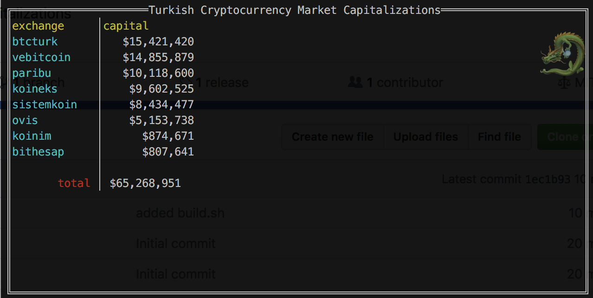

# mcap
Unfortunately CoinMarketCap.com can not list the total exchange markets for the country. There is also no API function related to this topic.

This tool retrieves data via the coinmarketcap.com domain. It indicates the volume of exchange market in Turkey.

## Download

 * OSX x64 https://github.com/c1982/mcap/releases/download/v1.0/mcap_darwin
 * Linux x64 https://github.com/c1982/mcap/releases/download/v1.0/mcap_linux
 * Windows x64 https://github.com/c1982/mcap/releases/download/v1.0/mcap_windows.exe

## Screen

## Components

* github.com/gdamore/tcell
* github.com/rivo/tview"
* github.com/gocolly/colly

## Bugz and Contact

Oğuzhan (aspsrc@gmail.com)